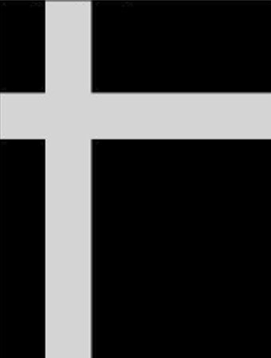

# Image Registration based on [Cross Power Spectral Density](https://en.wikipedia.org/wiki/Spectral_density#Cross_power_spectral_density)

## Overview
This project demonstrates the use of the _Cross Power Spectral Density_ for the use of image registration, which is the task of determining the translatory shift in horizontal and vertical direction of two similar images. The used algorithm goes back to the paper [The phase correlation image alignment method](http://boutigny.free.fr/Astronomie/AstroSources/Kuglin-Hines.pdf) in 1975 and is applied in many domains for image registration since then.

The full project is done with cuda and the [cufft](https://developer.nvidia.com/cufft) library and was created as my capstone project of the [GPU Specialization](https://www.coursera.org/specializations/gpu-programming) of the online-learning plattform Coursera.

My aim was to register images from the [FIRE Dataset](https://projects.ics.forth.gr/cvrl/fire/) which I thought was a cool. Some data of this dataset can be found with the `./data/FIRE_example` folder of this project. I am aware that this is not a proper solution of adding a dataset to a github repo, but due to infrastructure issues with the Coursera Servers, I was not able to work around this.

Unfortunatly, I was not able to do the registration on the targeted data. There were two main issues:
* Around the images of the retinas is a black background. This would make the registration impossible, since the hard edge from the black image background to the actual image would create much higher frequencies within the frequency domain of the fourrier transformation then everything else. So I decided to try cropping the images.
* Unfortunatly, I was not aware that the Cross Power Spectral Density is very sensity against rotations of the images. It can only determine shifts in horizontal and vertical directions properly. Therefore, the results of all images of the FIRE-Dataset is 0x0.

After this little drawback, I wanted to check if the algorithm works properly on syntetic images that are only contain translatory movements. I tried this by using the following two images:


and


The results were valid and, as we can see in the Example 2, the algorithm is ***very robust against changes in illumination*** (which can mathmatically proved).

All in all, I learned a lot about GPU programming, Thread modelling for GPUs, implementing GPU Kernels and how to use higher abstracted GPU libraries like cuFFT, even if the algorithm was not able to be applied to the targeted dataset.

Besides the algorithmic challenges, it was pretty hard to use CMake as a build configuration environment instead of the common Makefile-approach which was common within the GPU Specialization example code. I decided to use CMake since it is widly spead in the software industry, so I wanted to create something in a more practical setting as plain old Makefiles.  

## Code Organization
```build/```
This folder should hold all binary/executable and cmake-generated code that is built automatically or manually.

```data/FIRE_example```
This folder should hold all example data in `.jpg` format.

```src/```
Here you can find the source code. `main.cu` is the entrypoint to the C++/Cuda application as well as my self written GPU kernel code.

```include/```
Here are the include files of the project. It is best practice to split between src und include in your repository.
Be aware that we have a subfolder `include/cudaAdvancedLibsFinalAssignment/` where the project includes are placed, whereas `CLI11.h` (a header based command line parsing library) is directly placed under the include folder.

```output/```
This is (by the time you are cloning the repository) an empty folder that is used to save the results of the algorithm. Besides the Cross power spectral density matrices, the folder will contain a .csv file where you can read the associated files as well as the shifts in x (horizontal) and y (vertical) with the power of the spectral peak.

```Makefile```
This is the script which should be used by the user of this repository.

```CMakeLists.txt```
This is the CMake build script on which the Cuda application is build.

```run.sh```
***DO NOT CALL THIS ON YOUR OWN IF YOU DO NOT KNOW WHAT YOU ARE DOING.*** This will run all programs. It will be invoked by the `Makefile`

## Supported OSes
Linux

## Supported CPU Architecture
x86_64

## CUDA APIs involved
* Cuda Runtime API
* NVidia cuFFT library

## Prerequisites
Download and install the [CUDA Toolkit 12.6](https://developer.nvidia.com/cuda-downloads) for your corresponding platform.
Make sure the dependencies mentioned in [Dependencies]() section above are installed.

## Build and Run
First you have to download the repository on a linux machine on which the above mentioned software is installed. This is done by:

* ```$ git clone https://github.com/jweber94/cudaAdvancedLibsFinalAssignment.git```

You have to add the needed submodules by going into the project root folder and clone the submodules with git

* ```$ cd cudaAdvancedLibsFinalAssignment```

Now you are able to use the `Makefile` to use the algorithm. By calling the _all_ target, everything will be executed on its own:

* ```$ make all```

If you want the system under your own control, feel free to inspect the `Makefile` to see whats happening in the background.
